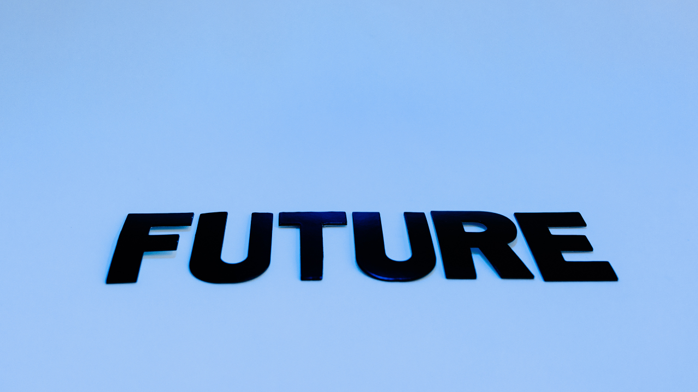

It is very important to be fully prepared for a job interview, it will make you feel in control, and you will appear confident, relaxed, and collected to recruiters. Most importantly, it shows that you are truly interested in the job and the company, which could really impress recruiters.

Interview preparation can be stressful, sometimes you feel nervous about meeting strangers who will eventually decide if you are getting the job or not. Pre-interview anxiety is common, things like talking about yourself, selling yourself, and being judged on your behaviour or appearance can make you nervous. 

But in this age of advanced technology, you can maximise your chances of getting a job by using Artificial Intelligence (AI) technologies that will help you to better prepare yourself for an interview.

### **AI-powered Interview platforms to leverage**

Several AI-powered interview platforms can help you practise your interview skills, such as Mya and Interview AI. These platforms use natural language processing and machine learning algorithms to simulate a real interview experience and provide you with feedback on your responses.

AI can be used to research the company and the position you are applying for. You can use tools like Crystal Knows to analyse the job description and company website to understand the skills and traits the employer is looking for, and then use this information to accommodate your responses accordingly.

You can use AI to analyse your resume. There are AI-powered resume analysis tools, like Jobscan and RezScore that can help you optimise your resume for the job you are applying for. These tools use machine learning algorithms to match your resume to the job description and provide feedback on areas where you can improve.

Get feedback on your interview skills: AI-powered video analysis tools, such as HireVue and Pymetrics, can analyse your nonverbal communication during a mock interview. These tools use computer vision and machine learning algorithms to analyse your facial expressions, tone of voice, and body language, and provide feedback on areas where you can improve.

### Use AI but avoid being extremely dependent on it

As you make use of technology to make your life easier, we encourage you to still continue practising your skills and not fully depend on AI. We cannot deny how simpler things have been made by AI, however, we do not encourage you to throw all your work on AI, but rather utilise it when necessary.