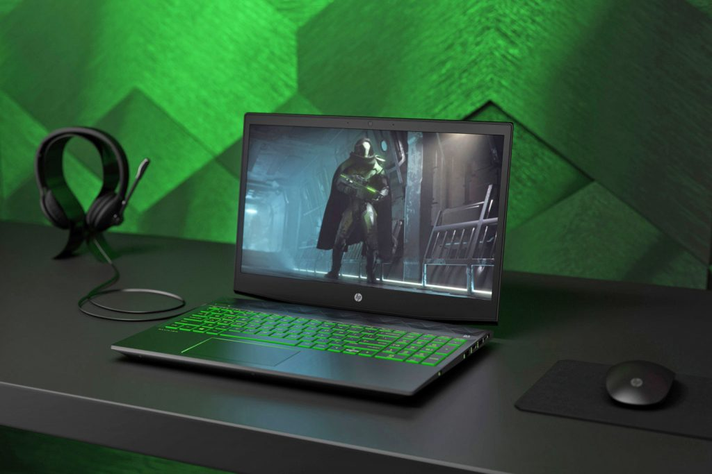
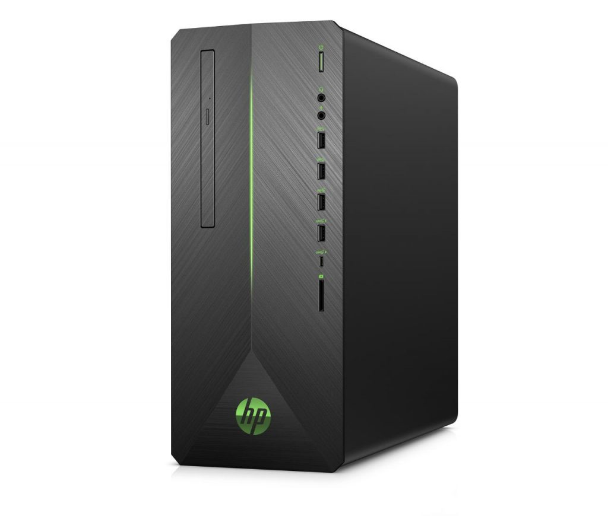
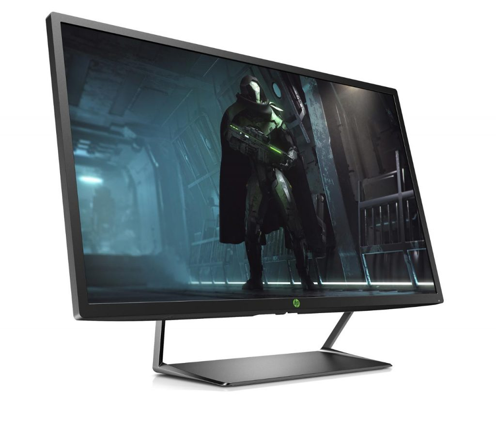

This will be the mainstream range to compliment their well-received Omen line of gaming rigs.

The majority of the gamer-focused [laptops](https://knowtechie.com/xiaomi-aims-for-the-gaming-market-with-their-mi-gaming-laptop/) and PC’s are aimed firmly at the high-end or enthusiast segments of the market. HP’s own research has shown that 62% of the gaming market is what they consider mainstream, essentially, people who either casually game or just need a high enough specification to run the games they like without eye-bleeding speed. Enter the new HP Pavilion Gaming range, aimed at these gamers with a price tag to match their needs.

At launch, there will be one laptop, two desktop models, and a monitor available. HP says these will be able to meet the needs of the casual user who wants one device to handle their PC needs.

The [HP Pavilion Gaming laptop](https://www.theverge.com/circuitbreaker/2018/4/11/17219052/hp-pavilion-gaming-laptop-desktop-monitor-announced) comes in one form factor only, at 15.6″, and will be available in a number of configurations. All come with 8th-generation i5 or i7 Intel processors, with a choice of either H-series performance chips or U-series mobile chips with more power saving. They all come with 8GB of RAM and multiple storage options, from single HDDs up to 2tb in capacity or 256gb NVME, to dual drive with a mix of NVME, HDDs or Optane. They will have graphics options up to an AMD Radeon RX 560X or NVIDIA GeForce GTX 1060 with MAX-Q Design.

There’s the familiar gaming vibe going on here, with edgy angles, backlit keyboards with their futuristic lettering, and options of green, pink and white for the H-series equipped range, with white backlighting on the U-series equipped laptop. There are also options on screen configuration, with options of a 1080p screen in either 60 or 144hz, and a 60hz 4k screen to round out the range. Pricing will start at $799, which is about right for the mainstream market segment. We’ll have to wait to see where the pricing ends up for the higher configurations closer to their availability on May the 15th.

HP continues the green theme here, using it for all the accents on both desktops in the range. I like what their design team came up with here, it’s understated and not the usual flash of gaming-focused hardware. The HP Pavilion Gaming 690 Desktop is the smaller brother of the range, with a smaller optimized footprint. Small doesn’t mean lacking in power, however, as it can be configured with the 6 core 8th Gen Intel® Core™ i7+, or 2nd Generation AMD Ryzen processors. This model can fit half-length graphics cards and has options for up to an AMD RX580 or Nvidia GeForce 1060. Again, a plethora of storage options are available, up to 16gb of DDR4 RAM. This model starts at $549 and is available starting on the 15th of April.

The bigger brother, the HP Pavilion Gaming 790 Desktop is a larger unit and as such can be specced even higher. This model can be specced up to 64gb of DDR4 RAM and paired with an [NVIDIA](https://knowtechie.com/nvidia-shield-review-roundup/) GeForce GTX 1080 or AMD Radeon RX 580 for [handling graphics](https://knowtechie.com/asrock-enters-the-graphics-card-market-with-phantom-gaming/). Starting price is $649 and will be available on HP.com on the 30th of April, and other retailers on June 3rd.

Both models have 5.1 sound, a card reader, USB-C and Bluetooth as standard.

Completing the range at launch is a huge 32″ monitor with 1440p resolution. This continues the green accents to present a cohesive design language. It’s one of the first [VESA certified HDR 600](https://www.vesa.org/featured-articles/vesa-defines-new-standard-to-help-speed-pc-industry-adoption-of%E2%80%A8high-dynamic-range-technology-in-laptop-and-desktop-monitor-displays/) monitors on the market, which promises a media experience that should outshine prior monitors. It also has a 75hz refresh rate and Freesync, although you’ll need an AMD graphics card to take advantage of the smooth framerates this provides. Console gamers can also benefit from this monitor, as it has two HDMI inputs. It’ll hit the market at $449.

[HP](https://www.amazon.com/Pavilion-WLED-backlit-Quad-Core-Processor-Bluetooth/dp/B077DN8TY3/ref=as_li_ss_tl?ie=UTF8&qid=1523895120&sr=8-6&keywords=hp+pavilion&linkCode=ll1&tag=knowt01-20&linkId=e5e69d72bb3cb65dd32e5bca115c6dc7) is also updating their normal Pavilion range, with new color options and some models with 8th-generation Intel processors.