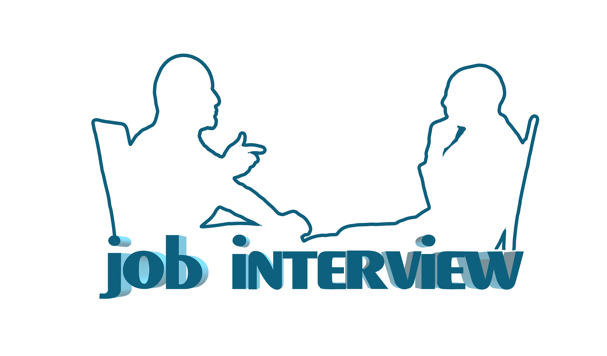

Transitioning from high school and college or university is a challenging process for most South African youth. After leaving the school system youth are challenged to make decisions that are very much likely to impact their future lives. Therefore, programs or institutions working with youth must be able to help youth become fit for the outside world, specifically the workforce. 

One of the pressing crises faced by South African youth is unemployment, the workforce is not absorbing youth who just exited the school system because they are questioning if these young people are employment ready. According to research, when youth leave the school system they wait to be employed to know if they are ready for employment. This is costly to youth and employers in such a way that youth remain unemployed and employers are pushed to invest in developing these young people’s skills to make them ready or fit for employment. On the other hand, this may contribute to employers being hesitant to offer opportunities to youth to gain much-needed work experience. 

If you are a young person living in South Africa, you are yet to learn about employment readiness in this article; what it is, how to be employment ready and lastly you will get a few tips on how to perform well in job interviews. 

Antoinette Crafford is an HR Specialist with over 20 years of experience in the Human Resources sector, she provided invaluable information about being employment ready as a young person living in South Africa. 

“Employment readiness refers to the ability to function well in a job, in some circumstances with little or no help at all. It means you have to be able to adapt to changes or challenges in your job and be able to deliver in the end”, says Crafford. 

There are a few factors that define your employment readiness which include your qualifications or certifications, critical thinking, and personal skills. Crafford says apart from qualifying, it is highly important that you have good communication skills, interpersonal skills, and the ability to work in teams. She emphasises the ability to think critically, “Even in a junior job position you must be able to make critical decisions to get things done”. 

## **How to equip yourself to be employment ready**

You must put yourself in a position that will give you some experience while you are still looking for employment. “You need to make use of opportunities that will not necessarily pay you to get the experience you need so that you can apply for positions that will pay”, says Crafford. 

Start looking for opportunities where you can volunteer even for learnerships and scholarships that will reward you with a portfolio of evidence in the end. Also, try to be entrepreneurial by reaching out to both small and big companies to do freelance work where the output is going to be a portfolio of work. 

In the opinion of Crafford, youth need guidance on how to look for opportunities and how to perform well in interviews to get employment. 

## **Ways to improve your interview performance**

Crafford says you must put your best foot forward when interviewing for a job, whether it is virtual or physical. Employers pay attention to whether you followed the instructions they gave you and if you are on time for the interview. 

If you want to create a good impression on the employer, dress the part when going to the interview, and research the company and the job title. “It is unappealing to the employer if you seem to not know anything about the company”, says Crafford. 

Be transparent in an interview, if you do not understand something, tell the employer. Similarly, if you know you are good at something, talk about it and show your portfolio. According to Crafford, “A portfolio is evidence of your ability to do things and can put you in an advantageous position for a job”. 

Lastly, you must know why you are applying for a job. Crafford says some people apply for certain jobs because they are motivated by the money, some are attracted to the challenges of the job specification and some apply because the job is in a convenient location. She advises that you define the reasons why you are applying for a job so that you can apply for the correct opportunities. 

## **Do not give up**

It is understandable that looking for a job in an economy like South Africa’s as a young person, is frustrating. “You cannot afford to give up,” says Crafford. 

Should you feel demotivated by rejection from job applications, Crafford recommends you keep your mind busy by trying online free courses, spend your time developing an online portfolio on platforms like Linkedin, and seek support from your loved ones. In addition, set realistic goals like applying for at least 3 jobs a day instead of sending many applications  until you lose count.  

Credits:

*Helping Youth Achieve Employment Readiness: Measuring Our Success by Valerie G. Ward and Dorothy I. Riddle (2022)*

*Factors influencing work readiness of graduates: An exploratory study by Anneline Carol Lindiwe Mashigo (2014)*