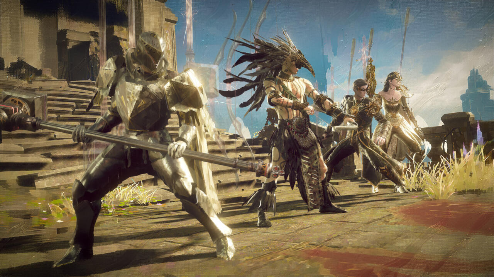

If you thought February was a busy month, wait until you see all the games landing in March.

February was jam-packed with titles and the launch of the Steam Deck, but now that the dust has settled, it's time for a relaxing March month…right? Not exactly, as the gaming industry is picking up speed for the month ahead. Between gung-ho action, a Final Fantasy prequel, and a new game of Bunkers and Badasses, March is stacked with high-profile releases. As usual, we've rounded up a few highlights below, and put together a list of games out this month that should help you prepare your bank account for all the digital temptation that lies ahead.

## Shadow Warrior 3 (March 1)

Previous Shadow Warrior games have been uncomplicated showcases of gratuitous violence, and Shadow Warrior 3 looks set to continue that tradition with reckless glee. The best-looking entry in the series so far, the game is all fast-paced first-person action and witty one-liners from protagonist Lo Wang. Shadow Warrior 3 is once again developed by Flying Wild Hog, [which was acquired by THQ Nordic parent company Embracer](<which was acquired by THQ Nordic parent company Embracer>) back in 2020.

[See on Steam](https://store.steampowered.com/app/1036890/Shadow_Warrior_3/)

## Babylon's Fall (March 3)

Platinum Games has been busy lately, and its next game is a departure from the linear single-player action that it has become known for over the years. While Babylon's Fall still has plenty of action packed into its cooperative RPG frame, [this title also happens to be a live service game](https://www.gamespot.com/articles/babylons-fall-confirmed-to-be-a-cooperative-action-rpg-for-ps5-ps4-pc/1100-6492794/), a first for the studio.

[See at Amazon](https://assoc-redirect.amazon.com/g/r/https://www.amazon.com/Babylons-Fall-PlayStation-5/dp/B09NB99CP2?tag=gamespotdeals-20&ascsubtag=ag%3Ags-1100-6500799%7Cvg%3A696067f3-c02b-482e-96ac-fe8a43dc728f%7Cst%3Adtp)